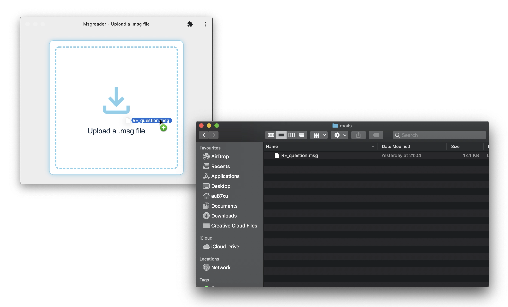
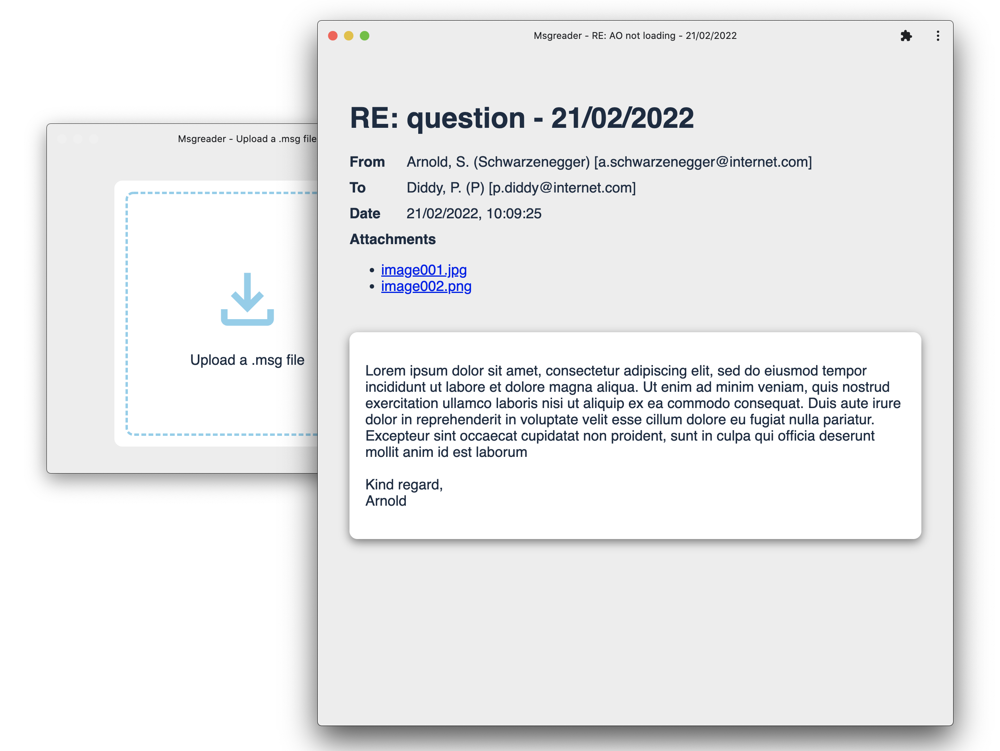

## [msg-reader](https://msg-reader.netlify.app/)

[link](https://msg-reader.netlify.app/)

## Scripts

- `start` runs your app for development, reloading on file changes
- `start:build` runs your app after it has been built using the build command
- `build` builds your app and outputs it in your `dist` directory
